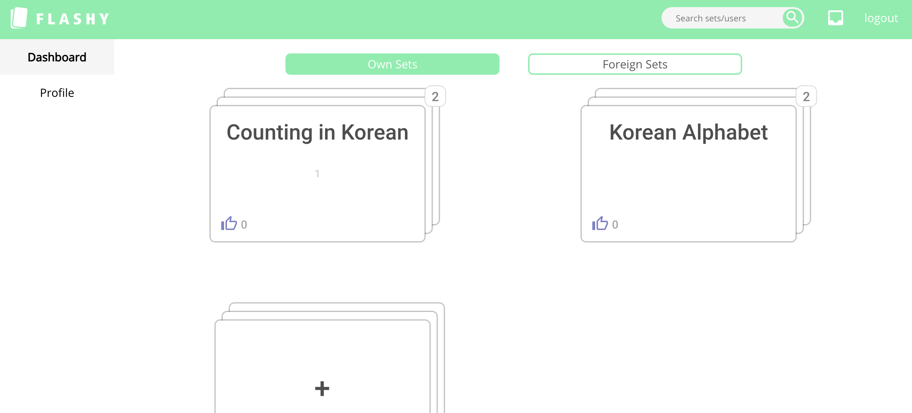
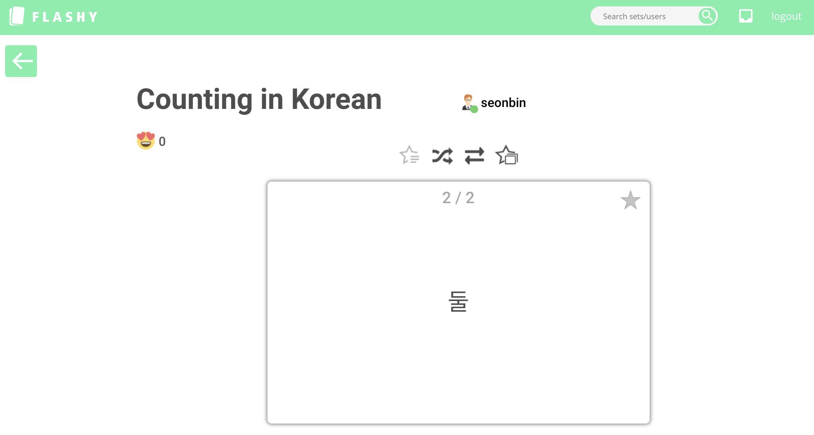
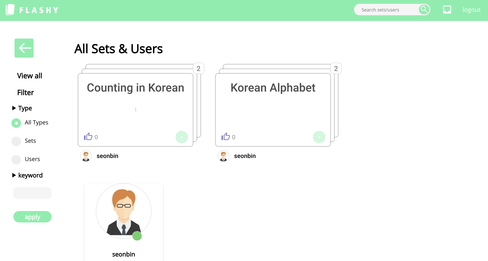

# FLASHY - Client Side

<h1 align="center">
  <br>
  <a href="https://github.com/sopra-fs21-group13"></a>
  <br>
  Flashy-Client
  <br>
</h1>


## Introduction
Flashy is an application with which students (and other users) can create digital fashcard stacks.
Besides the ordinary capabilities of physical fashcards, the ability to share the created stacks with other users, promoting the learning experience using social interaction and creating a good working environment.

A game component is also introduced, such that multiple users can participate competing against each other; seeing who can solve the stacks the fastest. We want to include a feature which captures the user's advancement towards manifesting their knowledge such as a reward system or experience/level type of thing. 

## Technologies used
- React class/ Hook
- Google login API
- Google material design
```bash
   npm install @material-ui/core
   npm install @material-ui/icons
```
- Formspree
```bash
   npm install @formspree/react
```

## High-level components
After you add sets from public set search page or created new sets by yourself, you can learn from the set(Learn button) or play game(Play button) with another user on the sets you have in the dashboard.

### dashboard Component
[link to the dashboard.js file](https://github.com/sopra-fs21-group-13/Client/blob/master/src/components/dashBoard/DashBoard.js)
- Own Sets: Sets created by yourself, by clicking set box with '+'
- Foreign Sets: Public sets you added to your dashboard, created by other users
- Want to find new flashcards to join?: Directing you to search sets&users page so that you can add new sets to your dashboard

### Learnpage Component
[link to the learnpage.js](https://github.com/sopra-fs21-group-13/Client/blob/master/src/components/learnPage/LearnPage.js)

Learn cards by flipping the cards to see the questions and answers, combining with the functions:
- learning only from starred cards
- shuffle
- flip the card
- starring all

### Game Component
[link to the game.js](https://github.com/sopra-fs21-group-13/Client/tree/master/src/components/game)
- User can invite online users to games, in which they can compete with each other on a chosen set.


## Launch & Deployment
For your local development environment you'll need Node.js >= 8.10. You can download it [here](https://nodejs.org). All other dependencies including React get installed with:

#### `npm install`

This has to be done before starting the application for the first time (only once).

#### `npm run dev`

Runs the app in the development mode.<br>
Open [http://localhost:3000](http://localhost:3000) to view it in the browser.

Open from specific browser: BROWSER=firefox npm run dev

The page will reload if you make edits.<br>
You will also see any lint errors in the console (use Google Chrome!).

#### `npm run test`

Launches the test runner in the interactive watch mode.<br>
See the section about [running tests](https://facebook.github.io/create-react-app/docs/running-tests) for more information.

> For macOS user running into an 'fsevents' error: https://github.com/jest-community/vscode-jest/issues/423

#### `npm run build`

Builds the app for production to the `build` folder.<br>
It correctly bundles React in production mode and optimizes the build for the best performance.

The build is minified and the filenames include the hashes.<br>
Your app is ready to be deployed!

See the section about [deployment](https://facebook.github.io/create-react-app/docs/deployment) for more information.

## Illustrations
In your client repository, briefly describe and illustrate the main user flow(s)
of your interface. How does it work (without going into too much detail)? Feel free to
include a few screenshots of your application.
### 1. Dashboard: view sets that users can learn from

### 2. Learning Page

### 3. Search page


## Roadmap: The top 2-3 features that new developers who want to contribute to your project
- Gaming for more than 2 users can be good to be implemented later
- img uploading for user profiles and sets


## Authors and acknowledgment
- [Kiram Ben Aleya](https://github.com/SoftwareConstructionGroup)
- [Seonbin Kim](https://github.com/seonbinnn) 
- [Remus Nichiteanu](https://github.com/rnichi1) 
- [Nazim Bayram](https://github.com/NazimBayram)
- [Silvan Caduff](https://github.com/sicadu)

## License: Say how your project is licensed 
opyright (c) 2021 Flashy.

Permission is hereby granted, free of charge, to any person obtaining a copy of this software and associated documentation files (the "Software"), to deal in the Software without restriction, including without limitation the rights to use, copy, modify, merge, publish, distribute, sublicense, and/or sell copies of the Software, and to permit persons to whom the Software is furnished to do so, subject to the following conditions:

The above copyright notice and this permission notice shall be included in all copies or substantial portions of the Software.

THE SOFTWARE IS PROVIDED "AS IS", WITHOUT WARRANTY OF ANY KIND, EXPRESS OR IMPLIED, INCLUDING BUT NOT LIMITED TO THE WARRANTIES OF MERCHANTABILITY, FITNESS FOR A PARTICULAR PURPOSE AND NONINFRINGEMENT. IN NO EVENT SHALL THE AUTHORS OR COPYRIGHT HOLDERS BE LIABLE FOR ANY CLAIM, DAMAGES OR OTHER LIABILITY, WHETHER IN AN ACTION OF CONTRACT, TORT OR OTHERWISE, ARISING FROM, OUT OF OR IN CONNECTION WITH THE SOFTWARE OR THE USE OR OTHER DEALINGS IN THE SOFTWARE.

